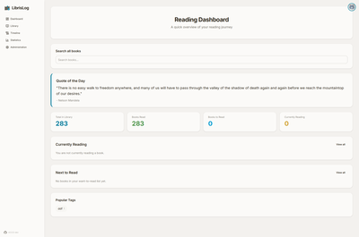
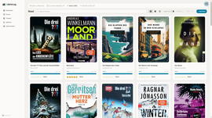
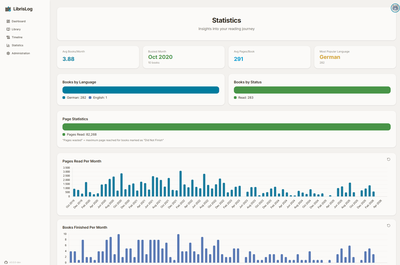
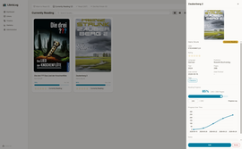
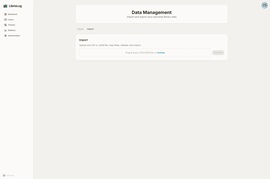
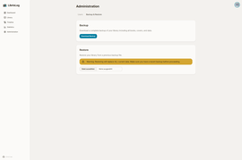

# LibrisLog

<p align="center">
  <a href="https://codebude.github.io/librislog/">📚 Full Documentation</a>
  &nbsp;·&nbsp;
  <a href="https://codebude.github.io/librislog/guide/getting-started">Quick Start</a>
  &nbsp;·&nbsp;
  <a href="https://codebude.github.io/librislog/api/">API Reference</a>
  &nbsp;·&nbsp;
  <a href="https://codebude.github.io/librislog/next/">Nightly Docs</a>
</p>

<p align="center">
  <a href="https://github.com/codebude/librislog/actions/workflows/tests.yml"></a>
  <a href="https://github.com/codebude/librislog/actions/workflows/docker.yml"></a>
  <a href="https://codebude.github.io/librislog/"></a>
  
  
  
  
</p>

**Multi-user book tracking webapp** — maintain four reading lists, import books from Open Library & Google Books, scrape cover art, and get rich reading analytics — all on your own hardware.

> `docker compose up -d` → full data ownership, no vendor lock-in, no API keys required.

---

## Quick Start

```bash
mkdir librislog && cd librislog
curl -O https://raw.githubusercontent.com/codebude/librislog/main/docker-compose.yml
curl -O https://raw.githubusercontent.com/codebude/librislog/main/.env.example
cp .env.example .env
# generate a random secret key
sed -i "s/CHANGE_ME_TO_32PLUS_CHARS/$(openssl rand -base64 32)/" .env
docker compose up -d
```

Open **http://localhost:8001** and create your account.

---

## Screenshots

<div>
  <a href="docs/public/screenshots/dashboard.png"></a>
  <a href="docs/public/screenshots/library-read.png"></a>
  <a href="docs/public/screenshots/statistics.png"></a>
</div>
<div>
  <a href="docs/public/screenshots/progress-detail.png"></a>
  <a href="docs/public/screenshots/data-import.png"></a>
  <a href="docs/public/screenshots/admin-backup.png"></a>
</div>

---

## Why LibrisLog?

- **Your data, your rules.** Fully self-hosted under MIT license — no ads, no tracking, no vendor lock-in. A single SQLite file you can back up anytime.
- **No API keys required.** Works with Open Library out of the box. Add Google Books or Hardcover.app tokens optionally for richer search results.
- **Rich insights from day one.** Calendar heatmap, language/status/page distribution charts, books finished per month/year, top authors — all on your hardware.
- **Multi-user from the start.** User roles (admin/user), optional OIDC SSO, per-user libraries. One instance works for your whole household or small group.
- **Import any format you have.** Goodreads CSV with automatic field mapping, generic CSV with per-field Python transforms, JSON, ZIP with covers.
- **Point your phone at an ISBN barcode.** Real-time barcode scanning in the browser — no native app required.
- **Cover art from multiple sources.** Automatic search across AbeBooks, Open Library, Amazon, and Hardcover — plus manual upload or URL paste.
- **Full REST API.** OpenAPI-documented backend you can script against — build your own frontend, connect home automation, or pipe data into your own tools.
- **Lightweight.** Two Docker containers, one SQLite database.
- **Bilingual UI.** English and German with a localization framework ready for more languages.

---

## Features

- **Library** — Grid/list view, search and sort, four reading statuses (Want to Read, Currently Reading, Read, Did Not Finish)
- **Reading progress** — Page-level slider, full progress timeline per book with edit/history
- **Statistics dashboard** — Calendar heatmap, distribution charts, books finished per period, top authors
- **Book import** — Search Open Library, Google Books, Hardcover.app. Scan ISBN barcodes on mobile. Manual entry for anything not found
- **Data portability** — Export as JSON, CSV, or ZIP with covers. Import from Goodreads or any CSV with custom field mapping
- **Cover management** — Automatic multi-source cover search with manual override, URL paste, or file upload
- **Data hygiene** — Find and fix missing metadata (covers, page counts, authors) in bulk
- **Multi-user** — Admin/user roles, per-user libraries, optional OIDC login
- **Themes** — Light, dark, and custom DaisyUI themes with persistent preferences
- **Administration** — Full backup/restore of the SQLite database, user management, API key management

---

## API

The backend is a standalone FastAPI application. The full API is documented via Swagger UI at `/api/docs` when the server is running.

Create API keys from the web UI (Profile → API Keys) for headless access. See the [API Reference](https://codebude.github.io/librislog/api/) for details.

```bash
cd backend
uv sync
uv run alembic upgrade head
uv run uvicorn app.main:app --reload
```

---

## Stack

| Layer | Technology |
|---|---|
| **Backend** | FastAPI, SQLModel, SQLite, Alembic, Pydantic v2 |
| **Frontend** | Svelte 5, SvelteKit, Tailwind CSS v4, DaisyUI v5 |
| **Auth** | Session cookies, optional OIDC (Authlib) |
| **Deployment** | Docker, Docker Compose |
| **Package managers** | `uv` (Python), `npm` (Node) |
| **Testing** | pytest + pytest-cov (backend), Vitest + Testing Library (frontend), Playwright (E2E) |

---

## Contributing

See the [Developer Setup](https://codebude.github.io/librislog/guide/developer-setup) guide for instructions on running LibrisLog locally, running tests, and using the CLI tool.

This project was developed with the assistance of AI coding tools under a human-supervised workflow. No AI-generated code is committed without human review and approval.

## License

MIT

## Star History

<a href="https://www.star-history.com/#codebude/librislog&Date">
  <picture>
    <source media="(prefers-color-scheme: dark)" srcset="https://api.star-history.com/chart?repos=codebude/librislog&type=Date&theme=dark" />
    <source media="(prefers-color-scheme: light)" srcset="https://api.star-history.com/chart?repos=codebude/librislog&type=Date" />
    
  </picture>
</a>
