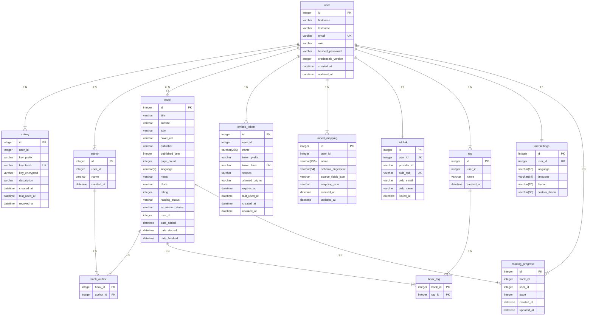

# Database Layout

> _Auto-generated from SQLModel metadata on 2026-08-24._

This page documents the LibrisLog database schema. It is intended for
developers who need to understand the data model, write queries, or extend
the application.

## Tables

### `user`

A user account.

| Column | Type | Constraints | Notes |
|--------|------|-------------|-------|
| `id` | `INTEGER` | PK | Auto-increment |
| `firstname` | `VARCHAR` | NOT NULL |  |
| `lastname` | `VARCHAR` | NOT NULL |  |
| `email` | `VARCHAR` | UNIQUE, NOT NULL |  |
| `role` | `VARCHAR` | NOT NULL, INDEX | default `user` |
| `hashed_password` | `VARCHAR` | NOT NULL |  |
| `credentials_version` | `INTEGER` | NOT NULL | default 0 |
| `created_at` | `DATETIME` |  | UTC |
| `updated_at` | `DATETIME` |  | UTC |

### `apikey`

API key for programmatic access.

| Column | Type | Constraints | Notes |
|--------|------|-------------|-------|
| `id` | `INTEGER` | PK | Auto-increment |
| `user_id` | `INTEGER` | FK → user.id, NOT NULL, INDEX |  |
| `key_prefix` | `VARCHAR` | NOT NULL, INDEX |  |
| `key_hash` | `VARCHAR` | UNIQUE, NOT NULL |  |
| `key_encrypted` | `VARCHAR` |  |  |
| `description` | `VARCHAR` |  |  |
| `created_at` | `DATETIME` |  | UTC |
| `last_used_at` | `DATETIME` |  | UTC |
| `revoked_at` | `DATETIME` |  | UTC |

### `author`

A user-specific author name that can be associated with books.

| Column | Type | Constraints | Notes |
|--------|------|-------------|-------|
| `id` | `INTEGER` | PK | Auto-increment |
| `user_id` | `INTEGER` | FK → user.id, NOT NULL, INDEX |  |
| `name` | `VARCHAR` | NOT NULL, INDEX |  |
| `created_at` | `DATETIME` |  | UTC |

**Unique constraint:** `(user_id, name)` — uq_author_user_id_name

### `book`

A book in the user's library.

| Column | Type | Constraints | Notes |
|--------|------|-------------|-------|
| `id` | `INTEGER` | PK | Auto-increment |
| `title` | `VARCHAR` | NOT NULL, INDEX |  |
| `subtitle` | `VARCHAR` |  |  |
| `isbn` | `VARCHAR` |  |  |
| `cover_url` | `VARCHAR` |  |  |
| `publisher` | `VARCHAR` |  |  |
| `published_year` | `INTEGER` |  |  |
| `page_count` | `INTEGER` | NOT NULL | default 0 |
| `language` | `VARCHAR(2)` |  |  |
| `notes` | `VARCHAR` |  |  |
| `blurb` | `VARCHAR` |  |  |
| `rating` | `INTEGER` |  | ≥ 1; ≤ 5 |
| `reading_status` | `VARCHAR` | NOT NULL, INDEX | default `want_to_read` |
| `acquisition_status` | `VARCHAR` | NOT NULL, INDEX | default `owned` |
| `user_id` | `INTEGER` | FK → user.id, INDEX |  |
| `date_added` | `DATETIME` | INDEX | UTC |
| `date_started` | `DATETIME` | INDEX | UTC |
| `date_finished` | `DATETIME` | INDEX | UTC |

**Unique constraint:** `(user_id, isbn)` — uq_book_user_id_isbn

### `embed_token`

A scoped embed token for iframe/dashboard integrations.

| Column | Type | Constraints | Notes |
|--------|------|-------------|-------|
| `id` | `INTEGER` | PK | Auto-increment |
| `user_id` | `INTEGER` | FK → user.id, NOT NULL, INDEX |  |
| `name` | `VARCHAR(255)` | NOT NULL |  |
| `token_prefix` | `VARCHAR` | NOT NULL, INDEX |  |
| `token_hash` | `VARCHAR` | UNIQUE, NOT NULL |  |
| `scopes` | `VARCHAR` | NOT NULL | default `embed:stats:read` |
| `allowed_origins` | `VARCHAR` |  |  |
| `expires_at` | `DATETIME` |  | UTC |
| `last_used_at` | `DATETIME` |  | UTC |
| `created_at` | `DATETIME` |  | UTC |
| `revoked_at` | `DATETIME` |  | UTC |

### `import_mapping`

A saved column-mapping configuration for data import.

| Column | Type | Constraints | Notes |
|--------|------|-------------|-------|
| `id` | `INTEGER` | PK | Auto-increment |
| `user_id` | `INTEGER` | FK → user.id, NOT NULL, INDEX |  |
| `name` | `VARCHAR(255)` | NOT NULL |  |
| `schema_fingerprint` | `VARCHAR(64)` | NOT NULL, INDEX |  |
| `source_fields_json` | `VARCHAR` | NOT NULL |  |
| `mapping_json` | `VARCHAR` | NOT NULL |  |
| `created_at` | `DATETIME` |  | UTC |
| `updated_at` | `DATETIME` |  | UTC |

**Unique constraint:** `(user_id, name)` — uq_import_mapping_user_id_name

### `oidclink`

Links an OIDC identity to a local user account.

| Column | Type | Constraints | Notes |
|--------|------|-------------|-------|
| `id` | `INTEGER` | PK | Auto-increment |
| `user_id` | `INTEGER` | FK → user.id, UNIQUE, NOT NULL |  |
| `provider_id` | `VARCHAR` | NOT NULL, INDEX |  |
| `oidc_sub` | `VARCHAR` | UNIQUE, NOT NULL |  |
| `oidc_email` | `VARCHAR` |  |  |
| `oidc_name` | `VARCHAR` |  |  |
| `linked_at` | `DATETIME` |  | UTC |

### `tag`

A user-specific tag that can be applied to books.

| Column | Type | Constraints | Notes |
|--------|------|-------------|-------|
| `id` | `INTEGER` | PK | Auto-increment |
| `user_id` | `INTEGER` | FK → user.id, NOT NULL, INDEX |  |
| `name` | `VARCHAR` | NOT NULL, INDEX |  |
| `created_at` | `DATETIME` |  | UTC |

**Unique constraint:** `(user_id, name)` — uq_tag_user_id_name

### `usersettings`

Per-user settings such as language, timezone, and theme.

| Column | Type | Constraints | Notes |
|--------|------|-------------|-------|
| `id` | `INTEGER` | PK | Auto-increment |
| `user_id` | `INTEGER` | FK → user.id, UNIQUE, NOT NULL |  |
| `language` | `VARCHAR(10)` | NOT NULL | default `en` |
| `timezone` | `VARCHAR(64)` | NOT NULL | default `UTC` |
| `theme` | `VARCHAR(20)` | NOT NULL | default `light` |
| `custom_theme` | `VARCHAR(30)` |  |  |

### `book_author`

Many-to-many association between books and authors.

| Column | Type | Constraints | Notes |
|--------|------|-------------|-------|
| `book_id` | `INTEGER` | PK, FK → book.id |  |
| `author_id` | `INTEGER` | PK, FK → author.id |  |

### `book_tag`

Many-to-many association between books and tags.

| Column | Type | Constraints | Notes |
|--------|------|-------------|-------|
| `book_id` | `INTEGER` | PK, FK → book.id |  |
| `tag_id` | `INTEGER` | PK, FK → tag.id |  |

### `reading_progress`

A page-number reading progress entry for a book.

| Column | Type | Constraints | Notes |
|--------|------|-------------|-------|
| `id` | `INTEGER` | PK | Auto-increment |
| `book_id` | `INTEGER` | FK → book.id, NOT NULL, INDEX |  |
| `user_id` | `INTEGER` | FK → user.id, NOT NULL, INDEX |  |
| `page` | `INTEGER` | NOT NULL | ≥ 0 |
| `created_at` | `DATETIME` |  | UTC |
| `updated_at` | `DATETIME` |  | UTC |

## Enums

### `AcquisitionStatus`

| Value | Meaning |
|-------|---------|
| `owned` | Owned |
| `borrowed` | Borrowed |
| `digital_access` | Digital Access |
| `to_acquire` | To Acquire |

### `ReadingStatus`

| Value | Meaning |
|-------|---------|
| `want_to_read` | Want To Read |
| `currently_reading` | Currently Reading |
| `read` | Read |
| `did_not_finish` | Did Not Finish |

### `UserRole`

| Value | Meaning |
|-------|---------|
| `admin` | Admin |
| `user` | User |

## Conventions

- **Timestamps** are stored as UTC via the `UtcDateTime` type decorator.
  Values are stored as naive UTC in SQLite and returned as timezone-aware
  `datetime` objects by the application.
- **Soft deletes** — `ApiKey` and `EmbedToken` use a `revoked_at` timestamp
  instead of `DELETE`. Revoked entries are excluded from all queries.
- **Foreign keys** — all user-owned tables reference `user.id` via foreign
  key constraints. Cascading behavior is handled in application code (not
  at the database level).
- **Unique constraints** — compound constraints like `(user_id, isbn)` on
  `book` and `(user_id, name)` on `tag` enforce per-user uniqueness without
  restricting other users.
